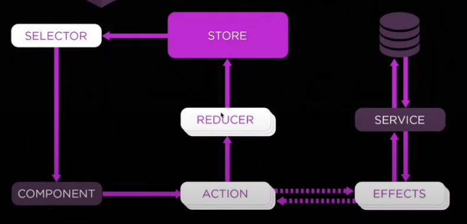

# Contents
[Parent Child](#Parent-Child) | [CommonModule](#CommonModule) | [Pipe](#Pipe) | [Routing](#Routing) | 
[Lazy Load](#loadComponent-Vs-loadChildren) | [Service](#Service) | [Dropdown](#Dropdown) | 
[Search](#Search) | [Standalone-app](#Standalone-app) | [Form-Validation](#Form-Validation) | 
[CheckBox](#CheckBox-with-for-loop) | [For Loop](#CheckBox-with-for-loop) | [Subscribe Options](#Subscribe-Options) | [Data Binding](#Data-Binding) | [Event Binding](#Event-Binding) | [AOT-JIT](#AOT-JIT) | [AOT-JIT](#AOT-JIT) | [Lifecycle Hooks](#Lifecycle-Hooks)
| [HTTP INTERCEPTOR](#HTTP-INTERCEPTOR) | [Route Guard](#Route-Guard) | [Ivy](#Ivy)
| [Angular Elements](#Angular-Elements) | [Promise vs Observable](#Promise-vs-Observable) | [Signal](#Signal) | [NGRX](#NGRX) | [Performance](#Performance) | 
[If Else](#If-Else) | [For Loop](#For-Loop) | [Time](#Time)

## Parent-Child
```Typescript
//PARENT
handleChildMessage(msg: string) {
    alert('Child says: ' + msg);
}
//CHILD
  @Input() user!: User; // Parent → Child
  @Output() notifyParent = new EventEmitter(); // Child → Parent
  sendMessageToParent() {
    this.notifyParent.emit(
      `User ${this.user.username} clicked "Notify" button`
    );
  }
```
```html
<!--PARENT-->
<app-user-details *ngIf="selectedUser" [user]="selectedUser" (notifyParent)="handleChildMessage($event)">
</app-user-details>
<!--CHILD-->
<button (click)="sendMessageToParent()">Notify Parent</button>
```
### Dropdown
```html
<select [(ngModel)]="selectedType" (change)="fetchData()">
  <option value="users">User</option>
  <option value="posts">Post </option>
</select>
```
```Typescript
selectedType: string = 'users';
```
### Search
```html
<input placeholder="Enter search text...." [formControl]="searchControl">
```
```Typescript
searchControl = new FormControl('');
ngOnInit(): void {
    this.searchControl.valueChanges
      .pipe(debounceTime(500))
      .subscribe((searchText) => {
        this.filteredUser(searchText || '');
      });
  }
    filteredUser(searchText: string) {
    if (!searchText.trim()) {
      this.filteredUsers = this.users;
    } else {
      this.filteredUsers = this.users.filter((u) =>
        u.username.toLowerCase().includes(searchText.toLowerCase())
      );
    }
  }
```
[
](#Data-Binding)
## Data-Binding
### Two way Binding
```html
<input [(ngModel)]="username" placeholder="Enter your name">
<p>Hello, {{ username }}!</p>
<!--String interpolation-->
```
### One way binding
- {{ message }}
- [property]="value"
### Signal binding
```Typescript
title = signal('My first angular APP');
```
```html
<p>{{title()}}</p>
```
### Event-Binding
- Input
```html
<input (change)="onInputChange($event)">
<input (blur)="onInputChange($event)">
<input (focus)="onInputChange($event)">
<input (keydown)="onInputChange($event)">
```
- Button
```html
<button (click)="onButtonClick()">Submit</button>
```
- Dropdown
```html
<select (change)="onDropdownChange($event)">
  <option value="option1">Option 1</option>
  <option value="option2">Option 2</option>
</select>
```
- CheckBox
```html
<input type="checkbox" (change)="onCheckboxChange($event)">
```
- Radio
```html
<input type="radio" name="options" (change)="onRadioChange($event)">
```
- Multiple ways to get hold on these events in typescript
```Typescript
export class AppComponent {
  username: string = '';
  onInputChange(event: Event) {
    const inputElement = event.target as HTMLInputElement;
    this.username = inputElement.value;
    console.log(event.type);
  }
}
```
[
](#Data-Binding)
## AOT-JIT
- In Angular, AOT (Ahead-of-Time) and JIT (Just-in-Time) are two different compilation strategies used to convert Angular 
HTML and TypeScript code into efficient JavaScript code.
- For prod build (ng build --prod) angular uses AOT by default.
- When you serve your app for development (ng serve) angular uses JIT by default.
  - We can enable AOT during development 
    - ng serve --aot
    - or in angular.json file add
```json
        "configurations": {
           "development": {
             "aot": true
           }
        }
```
## Directives 
- Are special markers on a DOM element that tell Angular to do something to that DOM element or its children. Directives are used to
extend HTML functionality by adding behavior to elements, such as manipulating their attributes or styling.
  - ngModel: 	It is used to bind to the HTML controls 
  - ngBind:		Binds the value with an HTML element 
  - ngShow:		Shows or hides the associated HTML element 
  - ngHide:		Conditionally hides an HTML element based on the truthiness of an expression. 
  - ngReadonly:	Makes HTML element read-only 
  - ngDisabled:	Use to disable or enable a button dynamically 
  - ngIf:		Removes or recreates HTML element 
  - ngClick:	Custom step on click 
  - ngSubmit:	Binds a function to the submit event of an HTML form, allowing execution of custom behavior on form submission.

## Lifecycle-Hooks
- Angular provides a set of lifecycle hooks that allow developers to execute code at specific stages of a component’s lifecycle
1. ngOnChanges, It is called before ngOnInit (if the component has bound inputs) and whenever one or more data-bound input properties change. It is used to respond to changes in input properties.
```Typescript
ngOnChanges(changes: SimpleChanges): void {
   if(changes['value']){
       console.log(changes['value'].previousValue)
       console.log(changes['value'].currentValue)
   }
}
```
2. ngOnInit, It is Called once, after the first ngOnChanges. It is used to initialize the component after Angular first displays the data-bound properties.
3. ngDoCheck, It is called during every change detection run, immediately after ngOnChanges and ngOnInit. It is used to detect and act upon changes that Angular can't or won't detect on its own.
4. ngAfterContentInit, It is called once after the first ngDoCheck. It is used to perform any additional initialization required for the content.
5. ngAfterContentChecked, It is called after ngAfterContentInit and every subsequent ngDoCheck. It is used to act upon any changes after the content has been checked.
6. ngAfterViewInit, It is called once after the first ngAfterContentChecked. It is used to perform additional initialization required for the view.
7. ngAfterViewChecked, It is called after ngAfterViewInit and every subsequent ngAfterContentChecked. It is used to act upon any changes after the view has been checked.
8. ngOnDestroy, It is called immediately before Angular destroys the component. It is used to clean up any resources, such as subscriptions and event handlers, to avoid memory leaks.

## Routing
```typescript
const routes: Routes = [
    { path: 'home', component: HomeComponent },
    { path: '', redirectTo: '/home', pathMatch: 'full' }, // Redirect empty path
    { path: '**', component: PageNotFoundComponent }, // Wildcard route for 404
    {
      path: 'my-page',
      loadChildren: () =>
         import('./my-input/my-input.component').then(m => m.MyInputComponent)
   }
   { path: 'user/:id', component: UserDetailComponent } //Dynamic angular routing
];

@NgModule({
    imports: [RouterModule.forRoot(routes)],
    exports: [RouterModule]
})
```
### Sample to dynamic routing 
```Typescript
import { Router } from '@angular/router';
constructor(private router: Router) {}
goToUser(id: number, event: Event) {
  event.preventDefault(); // HTML is like  => <a href="#" (click)="userDetails(i, $event)">{{user.name}}</a>
  this.router.navigate(['/user', id]);
}

import { ActivatedRoute } from '@angular/router';
constructor(private route: ActivatedRoute) {}
this.userId = this.route.snapshot.paramMap.get('id')!;
```
### OR directly handle the navigation in html
```html
<p *ngFor="let user of users; let i = index">
  {{i}} : 
  <a [routerLink]="['/user', i]">{{user.name}}</a>
</p>
```
## loadComponent-Vs-loadChildren
1. loadChildren, old style
    - Module level
    - Only if using feature modules
2. loadComponent
    - For standalone component
    - Component level
    - Recommended for 14+
    - Faster
    - add <router-outlet> in app.component.html — otherwise, lazy-loaded components won’t display.
## CommonModule
- CommonModule provides Angular's most commonly used directives and pipes.
- You don’t import it in AppModule because BrowserModule already includes it.
- You must import it in feature modules.
- It makes *ngIf, *ngFor, ngSwitch, ngClass, etc., work.

[
](#Data-Binding)
## Pipe
- Create pipe as 
```typescript
@Pipe({
   name: 'truncate'
})
export class TruncatePipe implements PipeTransform {
      transform(value: string, args?: number): string {
      if(!value) return "";
      if(value.length <= args) return value;
      return value.substring(0, args )+ "...";
   }
}
```
- Pass param like
```html
<div>{{ name | truncate : 5 }}</div>
```
### Pure and Impure Pipes
1. Pure
   - Default type of pipe. 
   - Executed only when input changes. 
   - Highly performant. 
   - Angular caches the result until the input value changes. 
   - Most built-in pipes are pure.
   - Example
     - uppercase, lowercase, date, currency, number, async
2. Impure Pipes
   - Called on every change detection cycle, even if the input hasn’t changed. 
   - More expensive than pure pipes. 
   - Used when dealing with mutable data like arrays, objects, or external sources.
   - How to make impure pipe
     ```typescript
     @Pipe({
          name: 'pipeName',
          pure: false
       })
     ```
   - When to use impure pipes:
     - When working with real-time data. 
     - When modifying an array or object in place.
## Service
- A service is a class that encapsulates reusable logic, which can be shared across different components of an Angular application. Services are typically used for data fetching, business logic, and other operations that need to be shared.
```Typescript
@Injectable({
  providedIn: 'root',
})

export class MyApiService {
  constructor(private http: HttpClient) {}
  basePath = 'https://jsonplaceholder.typicode.com/';
  getUsers(): Observable<User[]> {
    return this.http.get<User[]>(this.basePath + 'users');
  }
}
```
[
](#Data-Binding)
## Dropdown
```html
<select [(ngModel)]="selectedType" (change)= "fetchData()">
   <option value="users">Users</option>
   <option value="posts">Posts</option>
</select>
```
```Typescript
selectedType = 'users'; // default value
```

## Search
```html
  <input type="text" placeholder="Enter name to filter" [formControl]= "searchByName" />
```
```Typescript
  searchByName = new FormControl('');
  filterdUsers: User[] = [];
  
  ngOnInit() {
    this.searchByName
       .valueChanges
       .pipe(debounceTime(500))
       .subscribe((text) => {
         this.getFilteredUser(text);
       });
  }
  
 getFilteredUser(filterText: string) {
       if (!filterText.trim()) {
         this.filterdUsers = this.users;
       } else {
         this.filterdUsers = this.users.filter((u) =>
           u.name.toLowerCase().includes(filterText.toLowerCase())
         );
       }
  }
```
## Form-Validation
in module 
```Typescript
import { ReactiveFormsModule } from '@angular/forms';
```
```html
<form [formGroup]="userForm" (ngSubmit)="submitUser()">
  <label>Name :</label>
  <input type="text" formControlName="name" />
  <div *ngIf="userForm.get('name')?.touched && userForm.get('name')?.invalid">
    <small *ngIf="userForm.get('name')?.errors?.['required']">Mandatory</small>
    <small *ngIf="userForm.get('name')?.errors?.['minlength']">Min 3</small>
  </div>
  <br />
  <label>Email :</label>
  <input type="email" formControlName="email" />
  <div *ngIf="userForm.get('email')?.touched && userForm.get('email')?.invalid">
    <small *ngIf="userForm.get('email')?.errors?.['required']">Mandatory</small>
    <small *ngIf="userForm.get('email')?.errors?.['email']"
      >Enter correct format</small
    >
  </div>
  <br />
  <button type="submit" [disabled]="userForm.invalid">Submit</button>
</form>

```
```Typescript
export class UserComponent implements OnInit{
  constructor(private fb : FormBuilder){}

  users: User[]=[];

  userForm!: FormGroup;
  ngOnInit(): void {
    this.userForm = this.fb.group({
      name: ['', [Validators.required, Validators.minLength(3)]],
      email: ['',[Validators.required, Validators.email]]
    });
  }
  submitUser(){
    if(this.userForm.valid){
      this.users = this.userForm.value;
      this.userForm.reset();
    }
  }
}
```
[
](#Data-Binding)
## Standalone-app

### How to add routing module
1. Create app-route.ts
```Typescript
import { Routes } from '@angular/router';
import { HomeComponent } from './app/home-component/home-component';
export const routes: Routes = [
  {
    path: '',
    component: HomeComponent
  }
]
```
2. In main.ts
```Typescript
import { provideRouter, RouterOutlet } from '@angular/router';
@Component({
  selector: 'app-root',
  standalone: true, //✅ This one is NEEDED
  imports:[RouterOutlet], //✅ This one is NEEDED
  templateUrl: './app-component.html', //✅ This one is NEEDED
})
export class App {
  name = 'Angular';
}
bootstrapApplication(App, {
  providers: [
  provideRouter(routes), //✅ This one is for router
  provideHttpClient(
      withInterceptors([//✅ This one will be added only if we need httpinterceptor
        (req, next) => new AuthInterceptor().intercept(req, next)
      ])
    ) //✅ This one is for Http
  ], 
}); 
```
## CheckBox-with-for-loop
```html
<div *ngFor="let toDo of toDos; let i = index">
   <input type="checkbox" [checked]="toDo.isDone" (change)="updateIsDone(i)"/>
   <!-- toDo.isDone is boolean type-->
</div>
```
[
](#Data-Binding)
## Subscribe-Options
### forkJoin
- Emits once when all observables complete. 
- Returns results together. 
- Good for parallel independent API calls.
```Typescript
ngOnInit(): void {
 forkJoin({
   u: this.service.getUsers(),
   p: this.service.getPosts()
 }).subscribe({
   next: (res) => {
     this.users = res.u;
     this.posts = res.p;
   }
 })
}
```
### combineLatest
- Emits every time any observable emits a value. 
- Useful for real-time dashboards or reactive forms.
```Typescript
ngOnInit(): void {
 combineLatest({
   u: this.service.getUsers(),
   p: this.service.getPosts(),
 }).subscribe({
   next: (res) => {
     this.users = res.u;
     this.posts = res.p;
   },
 });
}
```
### zip
- Emits arrays of results. 
- Waits for one value from each observable before emitting. 
- Good when APIs must return synchronized data.
```Typescript
ngOnInit(): void {
 zip(
   this.service.getUsers(),
   this.service.getPosts()
 ).subscribe(([users, posts]) => {
   console.log(users, posts);
 });
}
```
### merge
- Does not wait for all observables to complete. 
- Emits results as soon as they arrive. 
- Good for faster page loading when APIs are independent.
```Typescript
ngOnInit(): void {
   merge(
     this.appService.getUsers(),
     this.appService.getPosts()
   ).subscribe(result => {
     console.log('Received:', result);
   });
}
```
### switchMap
- Cancels previous requests if a new one starts. 
- Ideal for search or auto-suggest features.
```Typescript
ngOnInit(): void {
   this.appService.getUsers()
  .pipe(
    switchMap(users => this.appService.getPosts()) // depends on users
  )
  .subscribe(posts => {
    console.log('Posts:', posts);
  });
}
```
### concatMap
- Runs one request at a time. 
- Good when APIs must execute in order.
```Typescript
ngOnInit(): void {
   this.appService.getUsers()
     .pipe(
       concatMap(users => this.appService.getPosts())
     )
     .subscribe(posts => {
       console.log('Posts:', posts);
     });
}
```
### Generic example
```Typescript
this.http.get('https://jsonplaceholder.typicode.com/posts')
  .pipe(
    // Retry 2 times if API fails
    retry(2),
    // Log API response
    tap(data => console.log('Raw:', data)),
    // Take only first 10 posts
    map((posts: any) => posts.slice(0, 10)),
    // Stop after first response
    first(),
    // Handle errors
    catchError(err => {
      console.error('Error:', err);
      return of([]);
    }),
    finalize(() => console.log('Request completed'))
  )
  .subscribe(data => {
    this.posts = data;
  });
```
### Different method on pipe and subscribe
```Typescript
observable.pipe(map(data => data.value)).subscribe(...)
observable.pipe(pluck('name')).subscribe(...)  >>> Extracts a property from each emitted object.
observable.pipe(scan((acc, val) => acc + val, 0)).subscribe >> similar to reduce
observable.pipe(filter(val => val > 10)).subscribe(...)
observable.pipe(first(val => val.active)).subscribe(...) >> Emits only the first value that meets a condition
observable.pipe(take(1)).subscribe(...) >> take only first n value
observable.pipe(distinctUntilChanged()).subscribe(...)  >> Emits only when the current value is different from the last.
observable.pipe(debounceTime(300)).subscribe(...)
```

| Operator          | Emits When?             | Best Use Case                   | Waits for All? |
| ----------------- | ----------------------- | ------------------------------- | -------------- |
| **forkJoin**      | When all complete       | Load all data once              | ✅ Yes          |
| **combineLatest** | Whenever any emits      | Reactive updates                | ❌ No           |
| **zip**           | When all emit **once**  | Pair one-to-one results         | ✅ Yes          |
| **merge**         | As soon as any emits    | Process results immediately     | ❌ No           |
| **switchMap**     | On latest value         | Cancel old requests, get latest | ❌ No           |
| **concatMap**     | Sequentially            | Ordered API calls               | ✅ Yes          |
| **exhaustMap**    | After current completes | Avoid duplicate API calls       | ✅ Yes          |
[
](#Data-Binding)
## HTTP-INTERCEPTOR
1. How to Create an HTTP Interceptor
- ng generate interceptor auth
```Typescript
import { Injectable } from '@angular/core';
import {HttpInterceptor,HttpRequest,HttpHandler,HttpEvent} from '@angular/common/http';
import { Observable } from 'rxjs';

@Injectable()
export class AuthInterceptor implements HttpInterceptor {
  intercept(req: HttpRequest<any>, next: HttpHandler): Observable<HttpEvent<any>> {
    const token = 'your-auth-token'; // You can get this from a service

    const authReq = req.clone({
      setHeaders: {
        Authorization: `Bearer ${token}`
      }
    });

    return next.handle(authReq);
  }
}
```
2. Register the Interceptor in AppModule
```Typescript
import { HTTP_INTERCEPTORS } from '@angular/common/http';
import { AuthInterceptor } from './auth.interceptor';

@NgModule({
  providers: [
    {
      provide: HTTP_INTERCEPTORS,
      useClass: AuthInterceptor,
      multi: true // 🔑 The multi: true flag is essential to allow multiple interceptors. They are executed in the order they are provided in the AppModule.
    }
  ]
})
export class AppModule {}
```
[
](#Data-Binding)
## Route-Guard
- ng generate guard auth
```Typescript
import { Injectable } from '@angular/core';
import { CanActivate, Router } from '@angular/router';

@Injectable({
  providedIn: 'root' // This makes it a singleton service
})
export class AuthGuard implements CanActivate {
  constructor(private router: Router) {}
  canActivate(): boolean {
    const token = localStorage.getItem('token'); // Example check

    if (!token) {
      this.router.navigate(['/login']);
      return false;
    }

    return true;
  }
}

//✅ In route module
  {
    path: 'dashboard',
    component: DashboardComponent,
    canActivate: [AuthGuard]
  }
```
- CanActivate: Determines if a route can be activated. 
- CanDeactivate: Checks if a route can be deactivated. 
- CanLoad: Determines if a module can be loaded lazily.
[
](#Data-Binding)
## Ivy
Ivy is Angular's next-generation rendering engine, introduced to improve performance and reduce bundle sizes. 
It offers faster compilation, more efficient rendering, and enhanced debugging capabilities. 
Ivy's advanced tree-shaking features eliminate unused code, leading to smaller and faster applications. 
Additionally, Ivy provides better backward compatibility, making it easier to update and maintain Angular applications.

To enable Ivy,  In tsconfig.json
```json
{
    "angularCompilerOptions": {
        "enableIvy": true
    }
}
```

## Angular-Elements
Web Component Integration: Allows Angular components to be packaged as custom elements (web components) that can be used in any HTML page or framework.

## Promise-vs-Observable
### Observable
- Multiple values over time: Observables can emit multiple values (streams), making them ideal for things like user input, WebSocket data, or any event-based data. 
- Lazy execution: Observables are not executed until you subscribe to them. 
- Operators: RxJS provides powerful operators like map, filter, merge, switchMap, etc., for complex data manipulation. 
- Cancelable: You can unsubscribe from an Observable to cancel the operation. 
- Angular integration: Angular’s HttpClient returns Observables by default.

### Promise (native JavaScript)
- Single value: A Promise resolves once with a single value or rejects with an error. 
- Eager execution: Promises start executing immediately when created. 
- Chaining: You can chain .then() and .catch() for handling results and errors. 
- Not cancelable: Once started, a Promise cannot be canceled. 
- Simpler syntax: Easier to use for one-time async operations like fetching data once.
- Example of use
- 3 stages of Promise
  - Pending: Initial state, neither fulfilled nor rejected.
  - Fulfilled: Operation completed successfully.
  - Rejected: Operation failed.

```Typescript
import { Injectable } from '@angular/core';
import { HttpClient } from '@angular/common/http';
import { Observable, firstValueFrom } from 'rxjs';

@Injectable({
  providedIn: 'root'
})
export class DataService {
  private apiUrl = 'https://jsonplaceholder.typicode.com/posts';

  constructor(private http: HttpClient) {}

  // Using Observable
  getDataObservable(): Observable<any> {
    return this.http.get(this.apiUrl);
  }

  // Using Promise
  async getDataPromise(): Promise<any> {
    return await firstValueFrom(this.http.get(this.apiUrl)); //converts the Observable to a Promise
  }
}


export class AppComponent implements OnInit {

  constructor(private dataService: DataService) {}

  ngOnInit(): void {
    // Using Observable
    this.dataService.getDataObservable().subscribe({
      next: (data) => console.log('Observable Data:', data),
      error: (err) => console.error('Observable Error:', err),
      complete: () => console.log('Observable Completed')
  
    });

    // Using Promise
    this.dataService.getDataPromise()
      .then(data => console.log('Promise Data:', data))
      .catch(err => console.error('Promise Error:', err))
      .finally(() => console.log('Promise Completed'))
  }
}
```
[
](#Data-Binding)
## Signal
- Best Practices
  - Use signals for local component state.
  - Prefer computed() for derived values.
  - Use effect() for side effects like logging or service calls.
  - Avoid mixing signals with RxJS unless necessary — signals are simpler and more performant for local state.
### Create a Signal
```Typescript
import { signal } from '@angular/core';
export class HomeComponent {
  homeMessage = signal("Hello world!"); // Writable signal
}
```
### Read Signal
```html
<p>{{ homeMessage() }}</p>
```
### Update Signal Value
```Typescript
this.homeMessage.set("Welcome to Angular Signals!");
//OR
this.homeMessage.update(msg => msg + " Part 2");
```
### React to Changes
```Typescript
import { effect } from '@angular/core';
effect(() => {
  console.log("Message changed:", this.homeMessage());
});
```
### Use Computed Signals
```Typescript
//Use computed() to derive values from other signals.
import { computed } from '@angular/core';
const count = signal(2);
const doubleCount = computed(() => count() * 2);// A computed signal is a derived value based on other signals. It’s read-only and automatically updates when dependencies change.

console.log(doubleCount()); // 4

count.set(3);
console.log(doubleCount()); // 6 (auto-updated

```
[
](#Data-Binding)
## NGRX

### Install
- ng add @ngrx/stor
- ng add @ngrx/effects
- ng add @ngrx/store-devtools

### Create app state
```Typescript
import { CartState } from "./cart/cart.reducer";
import { CounterState } from "./counter/counter.reducer";
import { ProuductState } from "./product/product.reducer";

export interface AppState {//It can hold state for multiple things
  counter: CounterState,//To maintain the state of counter
  cart: CartState,//To maintain the state of cart
  product: ProuductState//To maintain the state of product
}
```
### Creat action
```Typescript
import { createAction, props  } from "@ngrx/store";

export const increment = createAction('[Counter Component] Increment');
export const decrement = createAction('[Counter Component] Decrement');
export const reset = createAction('[Counter Component] Reset');
//OR
export const loadUserSuccess = createAction('[User] Load User Success', props<{ name: string; email: string }>());
```
### Create reducer to play with state
```Typescript
import {createReducer, on} from '@ngrx/store'
import { decrement, increment, reset } from './counter.actions'

export interface CounterState {
  count: number
}

export const initialCounterState: CounterState = {
  count: 0
}

export const counterReducer = createReducer(
  initialCounterState,
  on(increment, state=> ({...state, count: state.count + 1})),
  on(decrement, state => ({ ...state, count: state.count - 1 })),
  on(reset, state => ({ ...state, count: 0 }))
)
```
### Register the Reducer in App Module or main.ts
```Typescript
@NgModule({
  imports: [
    StoreModule.forRoot({ counter: counterReducer })
  ]
})
//In MAIN.ts

provideStore(),
provideState({ name: 'counter', reducer: counterReducer }),
```
### Create selector
```Typescript
import { createSelector } from "@ngrx/store";
import { AppState } from "../app.state";

export const selectCounterState = (state: AppState) => state.counter;

export const selectCount = createSelector(
  selectCounterState,
  (state)=> state.count
)
```
### Use in component
```Typescript
import { Component, inject } from '@angular/core';
import { Store } from '@ngrx/store';
import { Observable } from 'rxjs';
import { AppState } from '../states/app.state';
import { selectCount } from '../states/counter/counter.selector';
import { AsyncPipe } from '@angular/common';
import { decrement, increment, reset } from '../states/counter/counter.actions';
import { CounterStore } from '../store/counter.store';

@Component({
  selector: 'app-counter',
  standalone: true,
  imports: [AsyncPipe],
  templateUrl: './counter.component.html',
  styleUrl: './counter.component.scss',
  providers: [CounterStore],
})
export class CounterComponent {
  count$: Observable<number>;
  counterStore = inject(CounterStore);

  constructor(private store: Store<AppState>) {
    this.count$ = this.store.select(selectCount);
  }

  increment() {
    this.store.dispatch(increment());
  }

  decrement() {
    this.store.dispatch(decrement());
  }

  reset() {
    this.store.dispatch(reset());
  }
}
```
### Use in html
```html
{{counterStore.count()}}
```
### Add Effects
### Register effect
## Performance
1. Change Detection Optimization
    - Use ChangeDetectionStrategy.OnPush, i.e. to check the change only if
       - When an @Input() reference changes.
       - When an event inside the component occurs (e.g., button click).
       - When a signal or observable emits and updates the view.
    ```Typescript
      @Component({
      changeDetection: ChangeDetectionStrategy.OnPush
      // tells Angular to check for changes only when inputs change or events occur
    })
    ```
    - Avoid unnecessary bindings in templates that trigger change detection.
2. Lazy Loading Modules
3. Use Standalone Components
4. Tree Shaking & Bundle Optimization
      - Remove unused code and libraries.
      - Use ES modules and pure functions.
      - Enable production mode, ng build --configuration production
5. Efficient DOM & Template Usage
      - Avoid deep nested structures and excessive *ngIf/*ngFor.
      - Use trackBy in *ngFor to prevent re-rendering, with thius Angular will only re-render items whose id changed, even if the array itself is replaced.
        ```html
        <div *ngFor="let item of items; trackBy: trackById"></div>
        ```
        ```Typescript
        trackById(index: number, item: any): number {
          return item.id;
        }
        ```

6. Optimize Forms
      - Prefer Reactive Forms for complex scenarios.
      - Avoid frequent form value changes triggering change detection.
7. Optimize API Calls
      - Use RxJS operators like debounceTime, switchMap, and shareReplay.
      - Cache data where possible.
      - Avoid duplicate HTTP requests.
8. Use Signals for Local State
9. Check for Memory Leaks
      - Unsubscribe from observables in ngOnDestroy.
      - Avoid retaining references to DOM elements or services unnecessarily.
[
](#Data-Binding)
## If-Else
- Use *ngIf with else
```html
<div *ngIf="isLoggedIn; else loginTemplate">
  <h2>Welcome back, user!</h2>
</div>
<ng-template #loginTemplate>
  <h2>Please log in to continue.</h2>
</ng-template>
```
- Use *ngIf with then and else
```html
<div *ngIf="isLoggedIn; then loggedInTemplate; else loginTemplate"></div>
<ng-template #loggedInTemplate>
  <h2>Welcome back, user!</h2>
</ng-template>
<ng-template #loginTemplate>
  <h2>Please log in to continue.</h2>
</ng-template>
```
- Use ng-container to avoid extra DOM elements
```html
<ng-container *ngIf="isLoggedIn; else loginTemplate">
  <h2>Welcome back, user!</h2>
</ng-container>
<ng-template #loginTemplate>
  <h2>Please log in to continue.</h2> 
</ng-template>
```
- Use multiple conditions with else-if
```html
<div *ngIf="userRole === 'admin'; else userTemplate">
  <h2>Welcome, Admin!</h2>
</div>
<ng-template #userTemplate>
  <div *ngIf="userRole === 'user'; else guestTemplate">
    <h2>Welcome, User!</h2> 
  </div>
</ng-template>
<ng-template #guestTemplate>
  <h2>Welcome, Guest! Please log in.</h2>
</ng-template>
```
- Use @if(){ }
```html
@if(isLoggedIn) {
  <h2>Welcome back, user!</h2>
} @else {
  <h2>Please log in to continue.</h2>
}
```
[
](#Data-Binding)
## For-Loop
- *ngFor  
```html
<div *ngFor="let item of items">
  <h2>{{ item.name }}</h2>
</div>
```
- Use *ngFor with trackBy
```html
<div *ngFor="let item of items; trackBy: trackById">
  <h2>{{ item.name }}</h2>
</div>
```
```Typescript
trackById(index: number, item: any): number {
  return item.id;
}
```
- Use *ngFor with index
```html
<div *ngFor="let item of items; let i = index">
  <h2>{{ i + 1 }}. {{ item.name }}</h2>
</div>
```
- Use @for
```html
@for (user of users; track user) {
  <div>{{$index}} {{user}}</div>
  <div>{{$first}} {{user}}</div>
  <div>{{$last}} {{user}}</div>
  <div>{{$even}} {{user}}</div>
  <div>{{$odd}} {{user}}</div>
  <div>{{$count}} {{user}}</div>
}
```
- In case if users is empty
```html
@for (user of users; track user) {
  <div>{{$index}} {{user}}</div>
} @empty {
    <div>No Record found</div>
}
```
## Time
```Typescript
setTimeout(() => {
  console.log('This runs after 2 seconds');
}, 2000);
``` 
```Typescript
import { setInterval } from 'rxjs';
ngOnInit(): void {
  setInterval(() => {
    console.log('This runs after 2 seconds');
  }, 2000);
}
```
- To get hold of Interval to clear it latter
```Typescript
ngOnInit(): void {
  console.log(this.loading);
  this.intervalId = setInterval(() => {
    this.dataSubscription = this.service.getUser().subscribe({
      next: (res) => {
        console.log(res);
        this.loading = false;
        console.log(this.loading);
      }
    });
  }, 1000);
}

ngOnDestroy(): void {
  console.log("Destroyed!!");
  clearInterval(this.intervalId);
  if (this.dataSubscription) {
    this.dataSubscription.unsubscribe();
  }
}
```
- Using Interval from rxjs
```Typescript
import { interval, Subscription } from 'rxjs';
import { switchMap } from 'rxjs/operators';

dataSubscription: Subscription;

ngOnInit(): void {
  this.dataSubscription = interval(1000).pipe(
    switchMap(() => this.service.getUser())// cancel previous emissions if any running and switch to a new Observable.
  ).subscribe({
    next: (res) => {
      console.log(res);
      this.loading = false;
    }
  });
}

ngOnDestroy(): void {
  console.log("Destroyed!!");
  if (this.dataSubscription) {
    this.dataSubscription.unsubscribe();
  }
}
```
- Take()
  ```Typescript
  ngOnInit(): void {
    interval(1000)
      .pipe(
        take(5),
        switchMap(() => this.service.getUsers())
      )
      .subscribe({
        next: (res) => (this.users = res),
      });
  }
    ```
- TakeUntil()
  ```Typescript
    sub = new Subject<void>();
  ngOnInit(): void {
    interval(1000)
      .pipe(
        takeUntil(this.sub),
        switchMap(() => this.service.getUsers())
      )
      .subscribe({
        next: (res) => (this.users = res),
      });
  }

  ngOnDestroy(): void {
    this.sub.next();
    this.sub.complete();
  }
  ```
[
](#Data-Binding)
